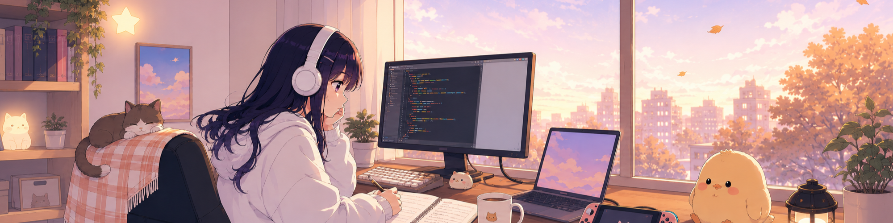

  
    Language:
    <strong>English</strong> /
    <a href="./README.ja.md">日本語</a>
  

  

    

  
You are the visitor number...

  
  
Thanks for stopping by 🐾

  

  <a href="#about-me">About</a> ·
  <a href="#research">Research</a> ·
  <a href="#experience">Experience</a> ·
  <a href="#tech-stack--tools">Tech Stack</a> ·
  <a href="#projects--activities">Projects</a>

  

## About Me

Hello, I'm **nnna1224**, a student at **University of Yamanashi**. 🍐

I work across **natural language processing, UI/UX design, game development, and web infrastructure**.  
I also enjoy creating **2D illustrations and written works**, both as personal projects and through collaborative creative activities.

I am interested in creating systems and works that are not only functional and accurate, but also considerate of users' contexts, emotions, and experiences.

I am a member of the [G^2 circle](https://g-2-yama.github.io), a student creative circle focused on original games and other creative works.

 

## What I Do

- **UI/UX Design**  
  Designing interfaces and user experiences for games, web projects, and interactive systems.

- **2D Illustration & Visual Creation**  
  Creating illustrations, character visuals, and visual assets.

- **Game System Programming**  
  Developing game systems and implementing interactive experiences.

- **Web & Development Infrastructure**  
  Building websites, maintaining development environments, and improving project workflows.

- **Creative Writing**  
  Writing stories and developing worldbuilding for original creative works.

- **Member Education**  
  Creating onboarding materials, training websites, and learning resources for new members.

 

## Research

I conduct research in **Natural Language Processing**, focusing on **machine translation for low-resource languages**.

My current research explores methods that combine neural machine translation systems with **large language models** to improve translation quality in low-resource settings.  

 

## Experience

### RAG-based Internal Document Management System

I work part-time at an IT company, where I am involved in developing an internal document management system using **RAG**.  
As the project is currently under development, I cannot disclose further details at this time.

### Game Development Circle

In my university game development circle, I have worked on UI/UX design, 2D illustration, system development, web infrastructure, and development environment maintenance.  
I also served as the circle leader during my third undergraduate year.

 

## Tech Stack & Tools

### Main

  

Rust / Python / C++ / C# / TypeScript / Unity / Docker / ShellScript / React / Git / GitHub

### Experienced

  

JavaScript / Java / Go / C / Django / Node.js / Next.js / Vue.js / Svelte / Astro / PostgreSQL / MySQL / Lua

### Familiar

  

PHP / Ruby / Unreal Engine

 

## Projects & Activities

| Period | Activity |
| --- | --- |
| Apr. 2026 - Present | New member training website development |
| Mar. 2026 - Present | Horror game project |
| Nov. 2025 - Dec. 2025 | Official website development for G^2 circle |
| Apr. 2025 - Present | Natural Language Processing research |
| Nov. 2024 - Oct. 2025 | 3D action game project |
| Nov. 2024 | Music game project |
| Oct. 2024 - Present | Part-time system development at an IT company |

 

Feel free to take a look at [my personal site](https://nnna1224.github.io/quartz) too.  
It is currently an unmaintained Zettelkasten, but it reflects part of my learning process. 🦀
